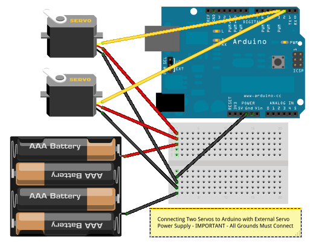

## Servos

Servos can be used with the ESP32 on any output ports that support PWM (pulse width modulation). The current version of Micropython for the ESP32 does not include direct support for servos, but you can use the PWM library to control them as discussed in the [ESP8266 Micropython documentation](https://docs.micropython.org/en/latest/esp8266/esp8266/tutorial/pwm.html#control-a-hobby-servo).

But there is a simple [Servo Python class definition](https://bitbucket.org/thesheep/micropython-servo) by [Radomir Dopieralski](https://bitbucket.org/thesheep/) that provides an easier interface for standard hobby servos.

### How To

-   **Download** - Get the servo Python class from here: <https://bitbucket.org/thesheep/micropython-servo/downloads/>
-   **Install Servo Library** - Use ampy to put the servo.py file on your device (you can delete the other downloaded files)

<!-- -->

    ampy -p /dev/tty.SLAB_USBtoUART put servo.py

-   **External Power** - The ESP32 cannot properly power a servo, so you must use an external power supply of 5 to 6 Volts (most hobby servos run on this). This can be [4 AA](https://www.adafruit.com/product/830) or [4 AAA](https://www.allelectronics.com/item/bh-44/battery-holder-4-aaa-cells/1.html?gclid=CjwKCAjw4sLVBRAlEiwASblR-_0YxFC1F8005xjriXw_vYbQ90sBTLn9MXfIM5p7ppEAEYIWInOkxhoC3_4QAvD_BwE) batteries, or a 3.3V LiPo with a [5V converter](https://www.adafruit.com/product/1903). The servo should connect to the power and ground of the battery, and the output pin on the ESP32. In addition, you **must connect the battery ground to the ESP32 ground**. This diagram shows this wiring approach for 2 servos connect to an Arduino, but it is the same approach for the ESP32.

### [servo_move.py](../examples/servo_move.py)

- **Test Servo Code** - The following simple program will create a Servo object, and then move the servo from the 0 degree position, to 180, and then 90.

<!-- -->

    import time
    import machine
    from servo import Servo

    servo_pin = machine.Pin(4)
    my_servo = Servo(servo_pin)

    my_servo.write_angle(0)
    time.sleep(2)
    my_servo.write_angle(180)
    time.sleep(2)
    my_servo.write_angle(90)

-   Note that each servo is different, and may not travel it's entire range with the default values of the Servo object. You can experiment by changing the min\_us and max\_us values when you create the Servo object if you use the fuller initialization arguments. See the servo.py source code for more details.

<!-- -->

    '''
    Args:
            pin (machine.Pin): The pin where servo is connected. Must support PWM.
            freq (int): The frequency of the signal, in hertz.
            min_us (int): The minimum signal length supported by the servo.
            max_us (int): The maximum signal length supported by the servo.
            angle (int): The angle between the minimum and maximum positions.
    '''
    my_servo = Servo(servo_pin, 50, 600, 2400, 180)

### [servo_cycle.py](../examples/servo_cycle.py)

This example uses threads to move a servo back and forth while allowing other processes in the main code to run.
